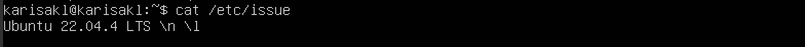
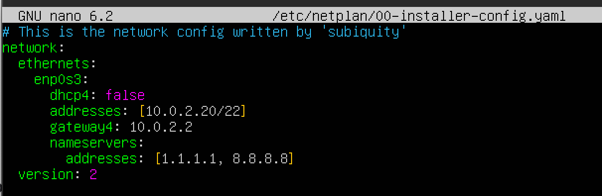
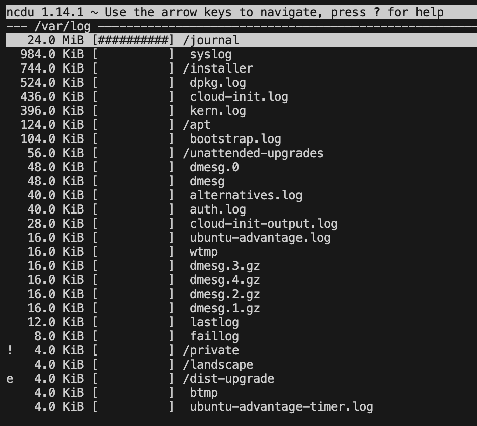

# UNIX/Linux

## Part 1. Установка OC

* Узнаем версию Ubuntu 
`cat /etc/issue`

## Part 2. Создание пользователя

* Создаем пользователя
`sudo adduser user1`

* Добавляем пользователя в адм
`sudo usermod -aG adm user1`

* Проверяем, добавлен ли пользователь в группу адм командой `groups`, перейдя сначала на него с помощью `su`

* Выполняем команду `cat /etc/passwd`

## Part 3. Настройка сети ОС

### 1. Изменение имени машины
* Меняем имя машины с помощью `sudo hostname user-1` и смотрим с помощью `cat /etc/hostname`,что имя поменялось

* Перезапускаем `sudo reboot` и видим что имя машины изменилось 

### 2. Установка временной зоны
* Меняем временную зону с помощью `sudo timedatectl set-timezone Europe/Moscow` и с помощью `timedatectl` видим изменения

### 3. Вывод названий сетевых интерфейсов
* Устанавливаем утилиту net-tools `sudo apt install net-tools`
* Смотрим нашу конфигурацию `ifconfig`

  * enp0s3 отвечает за внешнюю сеть
  * lo (loopback device) – виртуальный интерфейс, присутствующий по умолчанию в любом Linux. Он используется для отладки сетевых программ и запуска серверных приложений на локальной машине. С этим интерфейсом всегда связан адрес 127.0.0.1. У него есть dns-имя – localhost. Посмотреть привязку можно в файле /etc/hosts.

### 4. Получение сетевого адреса

* IP адрес устройства можно узнать с помощью команды `ip address`

* Сначала сбрасываем старый ip командой `sudo dhclient -r enp0s3`

* Получаем новый адрес устройства  с помощью команды `sudo dhclient -v enp0s3`

  DHCP (англ. Dynamic Host Configuration Protocol — протокол динамической настройки узла) — прикладной протокол, позволяющий сетевым устройствам автоматически получать IP-адрес и другие параметры, необходимые для работы в сети TCP/IP. Данный протокол работает по модели «клиент-сервер». Сетевой администратор может задать диапазон адресов, распределяемых сервером среди компьютеров. Протокол DHCP используется в большинстве сетей TCP/IP.

### 5. Получение IP-адреса

* Внешний IP можно узнать через сайт `wget -q -O - ifconfig.me/ip`, который вернёт нам наш адрес. Внутренний IP можно узнать командой `route -n` - в столбце Gateway будет искомый адрес.

### 6. Настройка статического IP

*  В директории /etc/netplan находится файл 00-installer-config.yaml, его откроем в текством редакторе с помощью команды `sudo nano /etc/netplan/00-installer-config.yaml`.
* Внесли изменения в строке dhcp4: false
* Добавили строки:
1. addresses: - статический ip адрес машины
2. gateway4: - ip адрес шлюза 
3. nameservers: и addresses: - ip адрес публичного днс сервера

* Вводим команду `sudo netplan apply` для применения конфигурации и команду `sudo netplan try` для применения изменений. Нажимаем Enter, чтобы принять изменения.
Теперь через `ifconfig` смотрим статический ip:

* Пропингуем удаленные хосты 1.1.1.1 и ya.ru, чтобы была фраза «0% packet loss».

## Part 4. Обновление ОС

* Обновляем список репозиториев через `sudo apt update`
* Обновляем версии пакетов `sudo apt dist-upgrade`
* Подтверждаем изменения
* Повторно вводим последнюю команду, чтобы убедиться, что обновления отсутствуют.

## Part 5. Использование команды sudo

* Cоздаем файл для нашего пользователя `sudo touch /etc/sudoers.d/user1` и открываем его в nano `sudo nano /etc/sudoers.d/user1`
* Записываем туда строку: user1 ALL=(ALL:ALL) ALL

  Где `user1` ALL=(ALL:ALL) ALL Первое поле показывает имя пользователя, которое правило будет применять к (user01).  
  user1 `ALL`=(ALL:ALL) ALL Первое “ALL” означает, что данное правило применяется ко всем хостам.  
  user1 ALL=(`ALL`:ALL) ALL Данное “ALL” означает, что пользователь user01 может запускать команды от лица всех пользователей.  
  user1 ALL=(ALL:`ALL`) ALL Данное “ALL” означает, что пользователь user01 может запускать команды от лица всех групп.  
  user1 ALL=(ALL:ALL) `ALL` Последнее “ALL” означает, что данные правила применяются всем командам.  
* Сохраняем и выходим, проверяем работу sudo, войдя под нашим вторым пользователем через `su user1`
* Выполним `sudo apt update` чтобы убедиться, что всё работает.
* Меняю hostname `sudo nano /etc/hostname` на user-2

  Sudo позволяет сисадмину делегировать полномочия, чтобы дать некоторым пользователям (или группе пользователей) возможность запускать некоторые (или все) команды c правами суперпользователя или любого другого пользователя, обеспечивая контроль над командами и их аргументами.

  Это альтернатива su для выполнения команд с правами суперпользователя (root). В отличие от su, который запускает оболочку с правами root и даёт всем дальнейшим командам root-права, sudo предоставляет временное повышение привилегий для одной команды.

## Part 6. Установка и настройка службы времени

* Установим ntpd `sudo apt install -y ntp` и проверим, что всё установилось `dpkg -l | grep "ntp"`
* Обновим список пакетов через `sudo apt update`. Проверим, что ntp подключён к серверам времени `ntpq -p`
* Сначала остановим ntp `sudo systemctl stop ntp`, затем принудительно синхронизируем время `sudo ntpd -gq`, команда выведет в конце количество микросекунд, на которое подправили наши часы.
* Снова запускаем `sudo systemctl start ntp`, проверим статус что запустили `sudo systemctl status ntp`
* Мне пришлось снести службу синхронизации времени, тк он не хотел выдавать мне yes `sudo apt-get purge ntp`
* После этого с помощью команды `timedatectl show`

## Part 7. Установка и использование текстовых редакторов

1. Надо создать файл, написать в нём свой никнейм, закрыть файл с сохранением изменений. 

* Создаём файл в vim `vim test_VIM.txt`, нажимаю i, чтобы открыть режим редактирования, пишу ник и для выхода с сохранением `:wq` выходим без сохранения с помощью `:q!`

* Создаем файл в nano `nano test_NANO.txt`, для выхода control+X, предложат сохранить файл, нажимаем "y" и "Enter"

* Установим `sudo apt install joe` и создадим файл `joe test_JOE.txt`, control+K X

2. Отредактировать файл, заменив никнейм на строку «21 School 21», закрыть без сохранения изменений.

* vim выходим без сохранения с помощью `:q!`

проверяем

* nano выходим без сохранения с помощью control+X, предложат сохранить файл, нажимаем "n" и "Enter"

проверяем

* joe выходим без сохранения с помощью `control+C`

проверяем

3. Отредактировать файл ещё раз (по аналогии с предыдущим пунктом), а затем освой функции поиска по содержимому файла (слово) и замены слова на любое другое.

* vim
  * `/21` для поиска

  * :s/\School\>/Home/ для поиска и замены

  * произвели замену

* nano 
  * Control+W R для поиска и замены

  * нашел нужное слово

  * ввели на которое меняем

  * произвели замену

* joe  
  * Control+K F
  * вводим слово которое надо найти

  * по курсору видим что нашел

  * вводим то слово которым надо заменить

  * подтверждаем замену

  * произвели замену

## Part 8. Установка и базовая настройка сервиса SSHD

* Установим службу `sudo apt install openssh-server` и откроем ее в редакторе `sudo nano /etc/ssh/sshd_config`
* Раскомментим #Port 22 и меняем цифру 22 на 2022

* Настройка автостарта службы при загрузке системы с помощью команды `sudo systemctl enable ssh`

* Добавление правила файрволла для порта 2022 с помощью команды `sudo ufw allow 2022/tcp`

* Перезагрузим ситему `sudo service sshd restart`
* Проверяем службу через `ps aux | grep sshd`
команда ps отображает список текущих процессов

  -a - выбрать все процессы кроме фоновых;

  -u - выбрать процессы пользователя;

  -x - отображение процессов, отсоединенных от терминала.

* `netstat -tan`

  netstat (network status) - отображает активные TCP-соединения, порты, которые прослушивает компьютер, статистику Ethernet, таблицу IP-маршрутизации.

  Ключи tan:

   -t - отображает статус подключения протокола передачи TCP;

   -a - отображает все активные соединения TCP и порты TCP и UDP, которые прослушивает компьютер.;

  -n - отображает активные TCP-соединения, однако адреса и номера портов выражаются в числовом виде, и попытки определить имена не предпринимаются.

  Значение столбцов вывода:

  Proto - название протокола;

  Recv-Q - очередь получения сети;

  Send-Q - сетевая очередь отправки;

  Local Address - локальный IP-адрес, участвующий в соединении или связанный со службой, участвующей в соединении.;

  Foreign Address - внешний IP-адрес, учавствующий в создании соединения;

  State - состояние соединение;

  Значение 0.0.0.0 - означает, что в соединении могут использоваться все IP-адреса на локальном компьютере.

  ## Part 9. Установка и использование утилит top, htop

* Вывод команды top

   uptime (как долго работает система) - 2 часа 9 минут

   количество авторизированных пользователей - 1

   общая загрузка системы - 0.00 (система в состоянии простоя)

   общее количество процессов - 96

   загрузка cpu - 0% 

   загрузка памяти - всего есть 1971,6 мебибайт оперативной памяти (1 мебибайт = 2^20 байт, 976.9 мебибайт ≈ 1 гигабайт): из них 164,4 занято, 669,1 свободно, 1138,2 занимает кэш системы.

   PID процесса, занимающего больше всего памяти - 650 (сортировку по памяти можно при помощи Shift+M)
   PID процесса, занимающего больше всего процессорного времени - 
   
* Вывод команды htop
   * Сортировка информации по PID
    
   * Сортировка информации по PERCENT_CPU 
    
   * Сортировка информации по PERCENT_MEM
    
   * Сортировка информации по TIME 
    
   * Фильтрация для процесса sshd 
    
   * Поиск процесса syslog
    
   * В вывод добавлены hostname, clock и uptime 
    

  ## Part 10. Использование утилиты fdisk

* Запускаем `sudo fdisk -l`

* Запускаем `swapon --show`

  * название жесткого диска /dev/sda
  * размер 10 GiB
  * количество секторов 20971520
  * размер swap 1.5 GiB

  ## Part 11. Использование утилиты df

  * Команда `df /`
  
   * Корневой раздел (/):

     * размер раздела: 8408452
     * размер занятого пространства: 4272424
     * размер свободного пространства: 3687312
     * процент использования: 54%

   * Единица измерения: Килобайт

  * Команда `df -Th /`
  

   * Корневой раздел (/):

     * размер раздела: 8.1 ГБ
     * размер занятого пространства: 4.1 ГБ
     * размер свободного пространства: 3.6 ГБ
     * процент использования: 54%

   * Тип файловой системы для раздела: ext4

  ## Part 12. Использование утилиты du

  * Запустим du
   

  * Выводим размер папок /home, /var, /var/log (в байтах): `sudo du -s --block-size=1 /var/log /var /home`
    * -s, --summarize - выводить только общий размер;
    * -B, --block-size - указать единицы вывода размераю.
   

  * Выводим размер папок /home, /var, /var/log (в человекочитаемом виде) `sudo du -sh /var/log /var /home`
    * -h, --human-readable - выводить размер в единицах измерения удобных для человека;
   
    
   * Выводим размер всего содержимого в /var/log (не общее, а каждого вложенного элемента, используя *) `sudo du /var/log/*`
   

  ## Part 13. Установка и использование утилиты ncdu
  * Установим `sudo apt install ncdu`

  * Результат работы команды `sudo ncdu /`
  * /home
  
  * /var
  
  * /var/log
  

  ## Part 14. Работа с системными журналами

* Открываем файлы логов через tail, она показывает последние 10 строк файла
* Результат работы команды nano /var/log/dmesg
dmesg - журнал содержит информацию о драйверах устройств.
 

* Результат работы команды nano /var/log/syslog
syslog - глобальный системный журнал, в котором пишутся сообщения от ядра Linux, различных служб, сетевых интерфейсов и т.д. с момента запуска системы.

* Результат работы команды nano /var/log/auth.log
auth.log - журнал содержит информацию об авторизации пользователей, включая удачные и неудачные попытки входа в систему, а также задействованные механизмы аутентификации.

   * время последней успешной авторизации 14:22:29
   * имя пользователя karisakl
   * метод входа в систему pam_unix

* Перезапустил SSHd с помощью команды sudo systemctl restart sshd

* Сообщения о перезапуске службы SSHd в журнале /var/log/syslog

  ## Part 15. Использование планировщика заданий CRON
* Вызываем crontab -e, выбираем редактор.
* Добавляем в коне строку */2 * * * * uptime | wall

    * crontab -e Редактирование или создание файла расписания для текущего  пользователя;

    * crontab -l Вывод содержимого расписания текущего пользователя;

    * crontab -r Удаление файла расписания текущего пользователя;

* строчки о выполнении cat /var/log/syslog
 
* cписок текущих заданий для CRON crontab -l
  
* Удалите все задания из планировщика заданий crontab -r проверить crontab -l

  